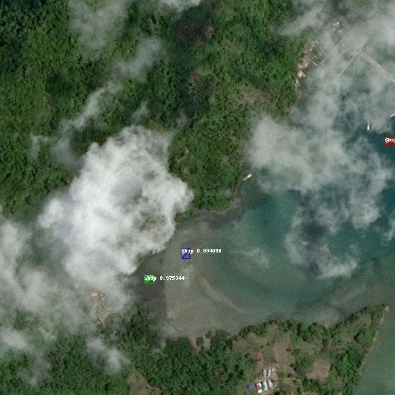
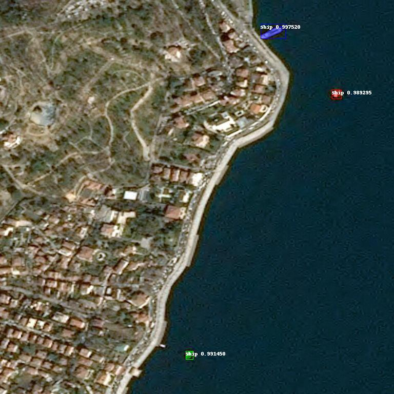
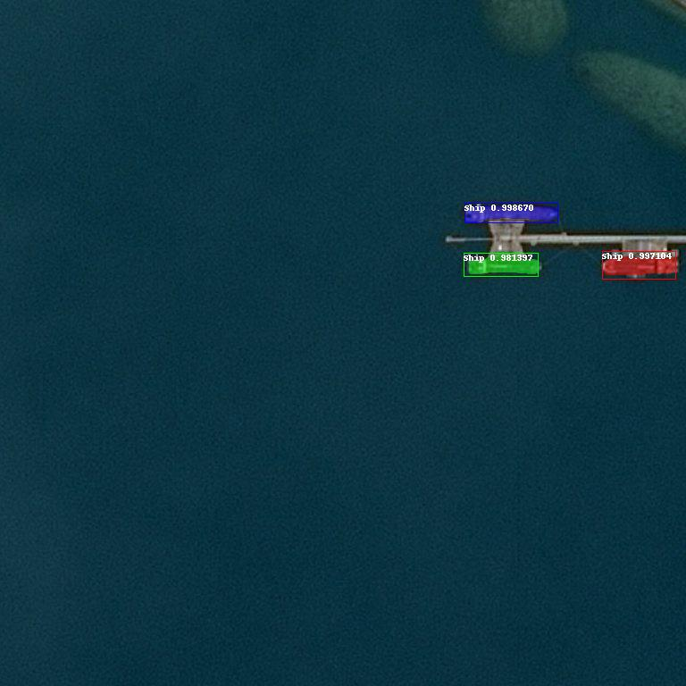

# Ship Detection
- Ship detection from satellite imagery using `tensorflow` and `mrcnn`
- Code is modified from a medium article, dataset is from kaggle ship detection challenge, sources will be added when I have time

### Model
- [Pretrained Image Model Link](https://drive.google.com/open?id=1gotjrrnmT3t86_9RVKOlnWjAqWTgpgn_)

### Python
1. Set up virtual environment
2. Install requirements
3. Download model and place in python directory
4. Run ship infererence scripts
    - `ship-infer-1.py` for training
    - `ship-infer-5.py` for single file running
    - `ship-infer-8.py` for input directory running all files

For problems install tensorflow try the follow:
`pip install https://storage.googleapis.com/tensorflow/mac/cpu/tensorflow-1.15.2-py3-none-any.whl`

### Docker
1. Build docker container
2. Run docker container 

---

